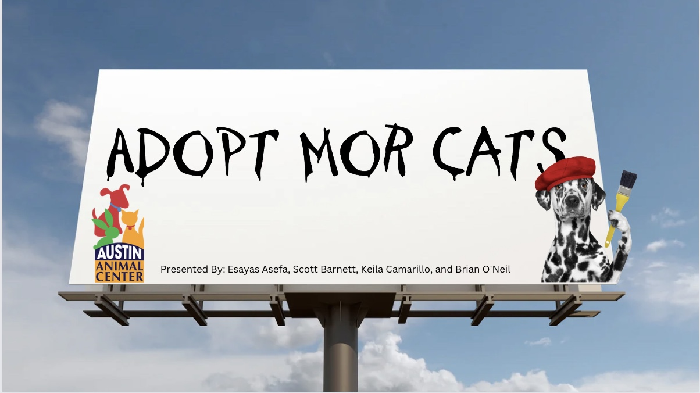

<h1>Animal Advocacy

### 10 July 2023

# Table of Contents 
1. [Project Description with goals](#project_description_with_goals)
    1. [Project Description](#project_description)
    2. [Goals](#project_goals)
    3. [Initial Thoughts](#initial_thoughts)
    4. [Initial Hypothesis](#initial_hypothesis) 
2. [Project Plan](#project_plan)
3. [Prepare](#prepare)
4. [Drawn Conclusions](#conclusions)
5. [Data Dicitonary](#conclusions)
6. [Steps to Reproduce](#steps)
7. [Exploration Summary](#exploration)
8. [Takeaways and Conclusions](#takeaways)
9. [Recommendations](#recommendations)
10. [Next Steps](#next_steps)
   

   
## Project description with goals

### Description
* Using the Austin Animal Center data from 2013 to present, our team will create a model to best predict whether an cat or dog will be adopted. The purpose is to give insight to animal shelters that can use the model as a tool to decide where to focus resources to increase adoption rates. The key is early intervention for cats/dogs to increase adoption resources on those with lower rates of adoption. 

### Goals¶
* Discover drivers of outcome
* Use drivers of outcomes to develop machine learning models to predict outcomes
* Identify Animals who are not likely to be adopted
* Provide data based solutions to reduce outcomes of "other"
* Present our options to our stakeholders

### Initial Thoughts
* Our initial thought is that the drivers of outcome will be breed, age, condition, species, and sex.

## Initial hypotheses and/or questions you have of the data, ideas

- What is the Percentage of Dogs and Cats?
- Are Months Related to Dogs/Cats Adoptablility?
- Is Breed Related to Outcome?
- Is Sex Related to Outcome?
- Is Species Related to Outcome?
- Is Condition Related to Outcome
- Is Intake Type Related to Outcome?
- Is Multi-Color Coat Related to Outcome?
- Are Tabby Pattern Coats Related to Outcome?
- Is Primary Coat Color Related to Outcome?

*****************************************

## Project Plan 
* Data acquired and join were from Austin Animal Center
    * Files were downloaded and converted to dataframes from xls format
* The data was aquired on `10 July 2023`
* Two datasets downloaded from data.austintexas.gov: [Intake Dataset](https://data.austintexas.gov/Health-and-Community-Services/Austin-Animal-Center-Intakes/wter-evkm) & [Outcome Dataset](https://data.austintexas.gov/Health-and-Community-Services/Austin-Animal-Center-Outcomes/9t4d-g238)
* Intake Dataset: 153,077 rows and 12 columns 
* Outcome Dataset: 153,449 row and 12 columns
* Each row represents an animal's case
* Each column represents features of the animal

## Prepare
* Two dataframes were created, model_df with encoded variables
* Altered column names for readability, and convenience
    - We removed spaces and capital letters
* Dropped nulls, duplicate ids, species other than cats and dogs
    - 12000 unique animal_id's were repeat offenders/duplicates (had been in the shelter more than once)
        - Their "intake date" however was input based on the first time they came into the shelter, in every instance of their intake
            - After discussion we decided to remove all animal_id's that had duplicates
    - We removed non-cats and non-dogs
        - We decided to it was impractical to keep animals that were uncommon to have as pets or see in urban settings
* Converted data types of various columns to appropriate ones such as 'dates' from string to datetime
* Columns and feature categories were renamed:
    Renamed Columns:
        - "outcome_type" was renamed to "outcome" (target variable)
        - Our original dataset had intake names, and outcome names for each animal when they'd rarely changed
            - We decided to keep their intake name column
            - "Animal type_x" to "species"
            - monthyear_x, and monthyear_y removed and 2 columns, one for month and one for year were created
       Feature Changes:
           - Conditions:
               - We changed 10 intake conditions to 6, based on what type of care they may need and survivability
                   - Outcome month and year:
                       - We decided after engineering features from our date based columns to only keep outcome month, year (both noted as rel_month, and rel_year), and age 
           - Breed:
               - Changed to "mix", "two_breeds", and "pure_breed"
                   - There were 2200
* Engineered Features: outcome, breed, outcome_age, primary_color, is_tabby, mix_color
    - Outcome was changed from 10 different outcomes to 3
        - If animals were placed in a home, they were categorized as "Adopt"
        - If animals were transfered to another facility they were categorized as "Transfer"
        - If animals had any other outcome they were categorized as "Other"
    - Outcome age was more important to us than the animals intake age, since we care primarily about what effects OUTCOMES for the animal
    - Primary color, is_tabby, and mix_color columns allowed to more easily boolean the feature than to have 4000 different colors
* Removed Features below: 
    - id - After removing all duplicates, no longer added value
    - name_x - names never/rarely changed
    - monthyear_x - after calculating age of outcome tenure_days (length of stay), decided it was unnecessary
    - sex upon intake - sex upon outcome was more appropriate
    - found location - we deemed this an unnecessary feature for our model
    - outcome subtype - only several hundred rows had outcome subtypes, we removed it 
    - intake_datetime - after calculating age at outcome, tenure_days (length of stay), and found it to be unreliable in thousands of rows since we were getting negative tenure days
* Split data into train, validate and test (approx. 60/20/20), stratifying on 'outcome'
* Outliers were not adressed as they were part of the target

## Draw conclusions
* June, July, August, and December had higher volumes
* Mixed breeds are more likely to be transfered or adopted
* Fixed animals are far more likely to be adopted
* Cats are slightly more likely to have an ‘other’ or transfer outcome than dogs
* Cats and dogs with normal conditions are more likely to be adopted.

## Data Dictionary
|Feature   |Datatype| Unit       |Description   |
|----------|--------|------------|--------------|
|DOB | Datetime64 | Date | Date of Birth|
|Outcome | String | Adopted, Transfer, or Other | The animals ultimate outcome.|
|Sex | String| Male or Female | Animal category: dog, cat, wildlife, other, etc.  |
|Name | String | Alphanumeric | name of animal|
|Intake_type | String | Abandoned, Euthanasia Request, Owner Surrender, Public Assist, Stray | The reason the animal came to the shelter |
|Condition | String | Aged, Injured, Medical, Medical Attention, Mental, Normal, Sick | What condition was the animal when the shelter received it. |
|Species | String | Dog or Cat |The species of the animal|
|Breed | String | Mix, Single Breed, and Two Breeds | The type of breed of the animal |
|Outcome_age | Int64 | Numeric | Age of the animal at time of outcome. |
|Rel_month | String | Alphanumeric | Outcome Month |
|Rel_month | String | Alphanumeric | Outcome Year |
|Primary_color | String | agouti, black, brown, buff, fawn, gold, gray, lilac point, lynx point, orange, red, sable, seal point, tan, tricolor, white |  Primary color of the animal's coat|
|Is_tabby | int64 | 0 or 1 | If the animal has a tabby pattern|
|Mix_color | int64 | 0 or 1 | If the animal has mixed colors|

## Steps to Reproduce
* 1. Clone this repo: https://github.com/pound-puppies/animal-advocacy
* 2. Go to team [Google Drive link here:](https://drive.google.com/drive/folders/1hV0WQezLiQpS06MIc0Kggy8Iq0mdoTLh) 
* 3. Download austin_animal_intakes.csv and austin_animal_outcomes.csv and put in cloned personal repository
* 4. Run notebook.

## Exploration Summary
- Identifed features that have a significant relationship with outcome:
    * rel_month:
        * Dogs are adopted more in December, January, February, and March and less in April, May, June, September, October, and November.
        * Cats are adopted more in December, January, February, July, and August and less in March, April, May, June, September, and October.
    * breeds: Mixed breeds are more likely to be transfered or adopted
    * sex: Fixed animals are far more likely to be adopted
    * species: Among dogs a higher percentage were adopted compared to cats
    * intake_type:
        * Cats and dogs that came in as abandoned, owner surrender, or public assist are more likely to be adopted.
        * Cats and dogs that came in as stray are less likely to be adopted
    * condition: Cats and dogs with normal conditions are more likely to be adopted.
    * mix_color: Cats and dogs with single-colored coats are more likely to be transferred
    * primary_color:
        * Dog's with the primary color gray and red are more likely to be adopted
        * Cat's with the primary color agouti, lynx point, and red are more likely to be adopted
- Features that will not be continuing to modeling:
    * Year_rel: Showed overall trend and would not be a accurate prediction
    * Dob: Data integrity issued was raised when we found negative ages
    * Outcome_age: Data integrity issued was raised when we found negative ages
    * Is_tabby: No statisical significance

## Takeaways and Conclusions
- Identifed features that have a significant relationship with outcome:
    * June, July, August, and December had higher volumes
    * Mixed breeds are more likely to be transfered or adopted
    * Fixed animals are far more likely to be adopted
    * Cats are slightly more likely to have an ‘other’ or transfer outcome than dogs
    * Cats and dogs with normal conditions are more likely to be adopted.
    
- Month of outcome, Breed of species, Sex, Species, Condition, Mix_color, Month_Rel:
    * Each feature had a statistically significant relaitonship with outcome

** Year_rel: Showed overall trend and would not be a accurate prediction**
** Outcome_age: Data integrity issued was raised when we found negative ages**

### Recommendations
* During the high adoptions months promote cats, mixed breeds, more by reducing adoption costs, adding stories and character traits.

* Data governance recommendations:
    - We found tens of thousands of rows with data that was missing and/or had nonsensical information
        * Collect more information such as: 
            - Incidents (e.g. biting, abuse hx) 
            - Stated reason for return 
            - Reasons for turn in by owners
            - Vaccination status
            - Who turned the animal in (e.g. citizen, law enforcement, organization)
            - Microchipped
     - Create a database for all animals that are ownded
         * Allow for anyone in the city to register their animals with us whether they are being dropped off or not
         * Collect data on those animals
             * Demographic information
             * Microchip
             * Health conditions
 * Business recommendations:
     - Organize special adoption events and campaigns during the months when dogs and cats are adopted less frequently.
         * Focus on promoting the benefits of adopting during these months, highlighting the joy of having a new furry friend for the upcoming year.
         * Put special emphasis on cats and dogs with single color coats
    - Promotional/Marketing Materials:
        * Highlight the unique qualities and/or advantages of owning:
            - Mixed-breed animals
             - Cats
         * Educating the public about:
             - Responsible pet ownership
                 * The importance of spaying and neutering their pets
                 * Leashes
                 * Microchips
                 * Collaring
                 * Properly securing the animal on their property
             - General benefits of owning a pet
             - The adoption pipeline,
                 * Positive stories
                 * The potential for negative outcomes and stories
                 * Emphasis on stray animals, cause and outcomes
    - Identify any points of friction for the adoption process and smoothen the process, provide support and education along the lifecycle of the animal
    - Partner with local business that would be willing to:
        * Host social events for people who adopted animals from our shelter
        * Allow us to use their store fronts
        * Provide discounts for our customers for a certain period of time if they registered their animal
        * provide discounts for collars, vaccines, microchips, and neutering/spaying for animals purchased, and registered with our shelter

### Next Steps
* If provided more time we would use NLP to review the polarity of the names. 
* Review other shelters with different features
* Research the cause of stray animals